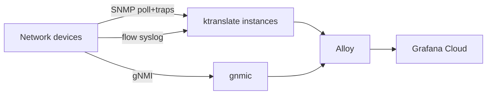

# ktranslate unified telemetry model

**Audience:** Operators and agents bringing up this demo on **any** platform (macOS, Windows/WSL, native Linux, or AWS/EKS).

**Goal:** One collector pattern everywhere — the [KtransToGrafana](https://github.com/Mesverrum/KtransToGrafana) golden path.

---

## The model (same on every platform)

| Role | Collector | What it does |
|------|-----------|--------------|
| SNMP (poll + traps) | `ktranslate_snmp_*` | One container: scheduled SNMP polls **and** UDP trap listener (`trap.listen` in poller config, e.g. `:1620`) |
| NetFlow | `ktranslate_flow` | Receives NetFlow v9 (softflowd in the lab; native export on real gear) |
| sFlow | `ktranslate_sflow` | Receives sFlow v5 counter samples from fabric devices |
| Syslog | `ktranslate_syslog` | Receives forwarded device syslog |
| gNMI streaming | `gnmic` | BGP/interface/LLDP subscriptions (not ktranslate) |
| Topology graph | `topology_exporter` (optional local/EKS) | SNMP device inventory when enabled |
| Egress | **Grafana Alloy** | OTLP fan-in, label enrichment, forward to Grafana Cloud |

**Rules:**

1. **One ktranslate container per traffic type** — SNMP polling and SNMP traps share **`ktranslate_snmp_*`** (same process, same config file). NetFlow, sFlow, and syslog each get their own container. Never combine SNMP with flow or syslog in one instance.
2. **Alloy is the OTLP sink** — ktranslate instances export gRPC OTLP to Alloy; Alloy forwards to Grafana Cloud.
3. **SNMP uses discover → poller** on the laptop lab (`make discover`); EKS uses a static device list in `k8s/telemetry/ktranslate-config.yaml`.
4. **Metric names are `kentik_snmp_*` and `network_io_by_flow*`** — dashboards in `local/dashboards/` and the oneclick import path target these names.
5. **Flow, sFlow, and syslog mount a generated device catalog** (`config/catalog.yaml`) that `@`-includes every group's `state/devices-<group>.yaml`. ktranslate matches flows/syslog to devices by `device_ip` and applies `global.user_tags` / per-device `user_tags` without polling (`--flow_only=true` on flow/sFlow). After any group's discovery run changes a device list, `reload-ktranslate-devices.sh` restarts all catalog consumers and all SNMP pollers.



---

## Platform differences (bootstrap only)

The **telemetry model is identical**. Only *how you start the lab* changes:

| Platform | Entrypoint | Linux runtime |
|----------|------------|---------------|
| **macOS** | `make deploy` or `./oneclick/deploy.sh` | OrbStack Ubuntu VM |
| **Windows** | `.\oneclick\deploy.ps1` | WSL2 Ubuntu |
| **Linux laptop** | `bash oneclick/lab-linux.sh deploy` | Host |
| **AWS/EKS** | `make post-03` … `make post-06` / `scripts/deploy-telemetry.sh` | Kubernetes |

All paths land the same signals in Grafana Cloud with the same metric names.

---

## Operator quick start (laptop)

```bash
cd local
cp .env.example .env          # GC_OTLP_URL, GC_OTLP_ACCOUNT, GC_OTLP_KEY
cp groups/srl.env.sample groups/srl.env
make generate && make check && make up
```

Or one command: `.\oneclick\deploy.ps1` (Windows), `make deploy` (macOS).

**Verify:**

```promql
count by (device_name, service_name) (kentik_snmp_DeviceMetrics)
topk(20, network_io_by_flow_bytes)
```

---

## Operator quick start (EKS)

After cluster + topology are up:

```bash
cp k8s/telemetry/grafana-cloud-secret.yaml.example k8s/telemetry/grafana-cloud-secret.yaml
# fill credentials, then:
bash scripts/deploy-telemetry.sh
```

Deploys **four** ktranslate Deployments — **SNMP** (poll + traps), flow, sFlow, syslog — plus Alloy and gnmic. Same roles as the laptop lab.

---

## Onboarding your own hardware

You do **not** need to understand repo internals. For gear outside this demo:

1. Stand up **one ktranslate container per traffic type** — SNMP (poll + traps together), NetFlow, sFlow, syslog (official ktranslate flags; OTLP to Alloy or Grafana Cloud).
2. Point devices at the right destinations: SNMP community for polling; **trap destination = same SNMP container** (`trap.listen` / `TRAP_PORT` in the poller YAML); flow and syslog to their respective listeners.
3. Run discovery — **MIBs and SNMP profiles are usually handled automatically.** ktranslate ships with [Kentik snmp-profiles](https://github.com/kentik/snmp-profiles); discovery matches each device's `sysObjectID` to a profile. If your platform is missing, follow the [ktranslate SNMP profile tutorial](https://github.com/kentik/ktranslate/wiki/Tutorial:-Writing-a-custom-yaml-file-for-SNMP) and open a PR to [kentik/snmp-profiles](https://github.com/kentik/snmp-profiles) rather than maintaining a local override.
4. Import dashboards from folder `network-lab` or `local/dashboards/`.

Real switches export NetFlow/sFlow natively — the lab's `softflowd` step is **simulator-only**.

---

## Where the details live

| Topic | Doc / path |
|-------|------------|
| Laptop commands | [`local/README.md`](../local/README.md) |
| One-click deploy | [`oneclick/README.md`](../oneclick/README.md) |
| Agent bring-up | [`AGENTS.md`](../AGENTS.md) |
| Networking concepts | [`docs/network-observability-primer.md`](network-observability-primer.md) |
| EKS manifests | [`k8s/telemetry/`](../k8s/telemetry/) |
| SNMP profiles (upstream) | [kentik/snmp-profiles](https://github.com/kentik/snmp-profiles) · [writing a profile](https://github.com/kentik/ktranslate/wiki/Tutorial:-Writing-a-custom-yaml-file-for-SNMP) |

**Do not maintain a separate "local vs EKS collector architecture" story** — both paths implement this document.
